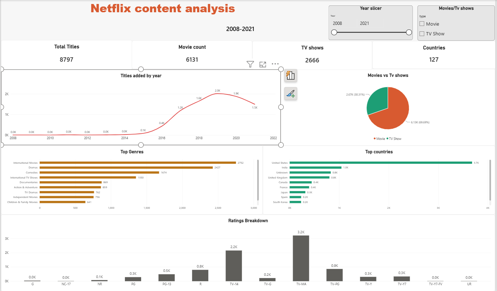

# Netflix-content-analysis
Netflix content catalog analysis — Python, SQL, Power BI"

## Objective
Netflix's content catalog spans thousands of titles added over more than a 
decade. This project looks at what's actually in that catalog — how fast 
it's grown, what kind of content dominates, where it comes from, and who 
it's made for — to understand the platform's content strategy so far and 
where there might be room to grow.

## Tools
Python (Pandas) for cleaning, MySQL for analysis, Power BI for the dashboard

## What I did
- Cleaned an 8,800+ title dataset (2008–2021) — handled missing values, 
  fixed a data entry error where duration values had leaked into the rating 
  column, and split multi-value genre/country fields into separate tables
- Wrote SQL queries to analyze content growth by year, genre and country 
  breakdowns, movie vs TV show split, and rating distribution
- Built a Power BI dashboard with KPI cards, trend charts, and breakdown 
  visuals, with year and content-type slicers

## What I found
- Content additions grew sharply from 2015, peaking around 2019–2020
- Movies make up ~70% of the catalog, TV Shows ~30%
- Dramas and International Movies are the top genres
- The US is the top content-producing country, followed by India and the UK
- Most content is rated for mature audiences (TV-MA)

## Takeaway
The catalog is heavily concentrated in US-produced, mature-rated movies. 
Since international content and TV shows make up a smaller share, there may 
be an opportunity to grow in those areas to reach a broader audience.

